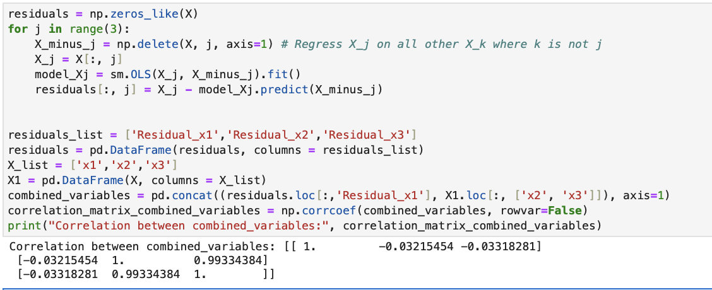
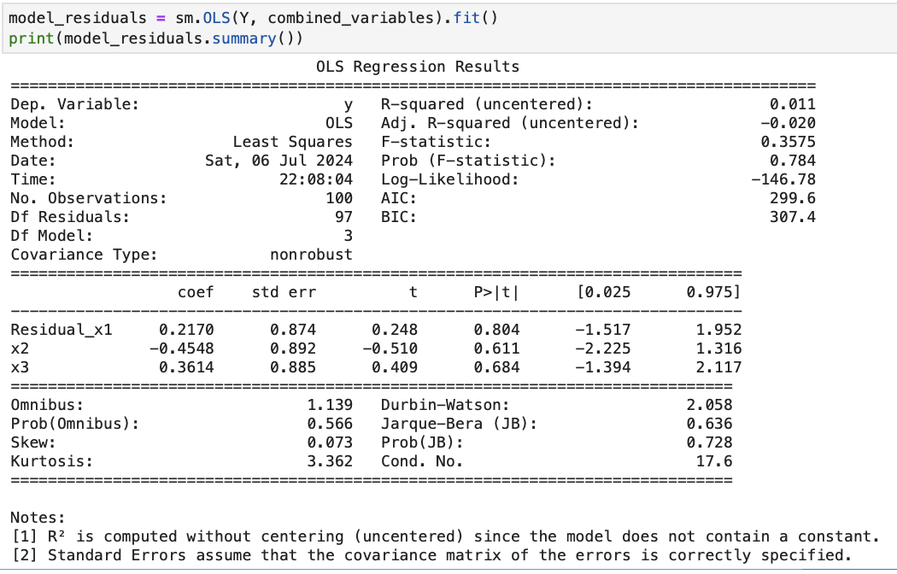

Hello, so I have been studying Linear models (including Ordinary Least Squares (OLS)) in the past few weeks. 
And I came across Frisch–Waugh–Lovell (FWL) Theorem. It basically states that multivariate regression can be deposed into (several) univariate regressions via holding one of the variable constant.

For example, you have a regression, 
$$y=\beta_{0}+\beta_{1}X_{1}+\beta_{2}X_{2}$$ 
So the steps for FWL theorem is
1. Regress $X_{1}$ on $X_{2}$ and take the residuals
2. Regress $y$ on $X_{2}$ and take the residuals
3. Regress the residuals from step 1 against the residuals from step 2 ($X_{1}-\hat{X}_{1}$ against $y-\hat{y}$)
	- you will get back the same coefficient ($\beta_{1}$) for $X_{1}$ as when regress $y$ on $X_{1}$ and $X_{2}$.

Mostly people have actually presented it in non-correlated/independent variables form. It works with correlated variables as well.

So first, lets generate some random variables of y, which is the target, and 3 inputs of x variable. 

Now that we have our random variables, we fit them onto OLS.

Next, we shall regress each $X$ on the other two $X$ and get the residual. Then, check their correlation between residual, which is residual_x1 as we trying to find the effect of x1, and the other two variables, x2 and x3  

We can see that the correlation between residual_x1, x2 and x3 changes, it become uncorrelated from highly correlated between x1, x2 and x3.

We regress y on Residual_x1, x2, x3.

you will see that the coefficient of Residual_x1 is the same as the coefficient of x1 as before. This is the beauty of FWL theorem. We can use this theorem to study the each input on how they affect other inputs.

FWL theorem works cause of residuals, which are leftover effects after accounting for all the inputs $X$ , are orthogonal to the predicted target $\hat{y}$. $$\epsilon^{T}\hat{y}=0$$ Which is why the correlation/coefficient changes between Residual_x1 and x2 and x3, even though, the coefficient of Residual_x1 and x1 did not change

## References
The Frisch-Waugh-Lovell Theorem (FWL Theorem) from https://www.hbs.edu/research-computing-services/Shared%20Documents/Training/fwltheorem.pdf

Orthogonality of residuals in linear regression from https://stats.stackexchange.com/questions/371629/orthogonality-of-residuals-in-linear-regression‌
