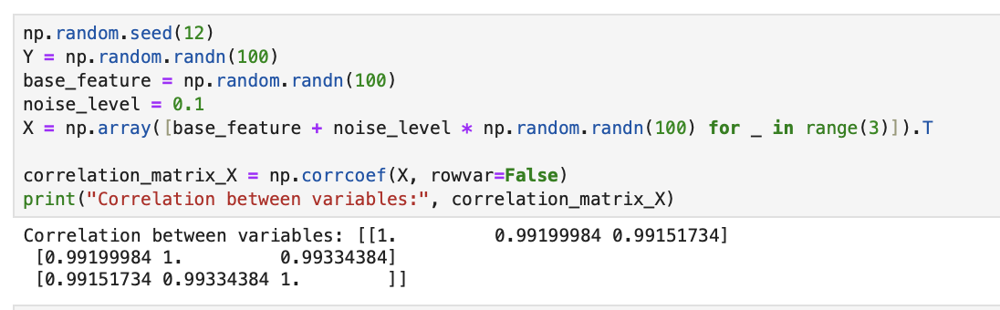
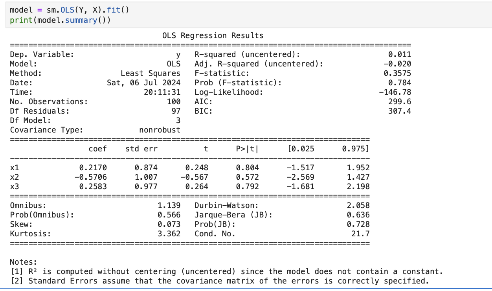
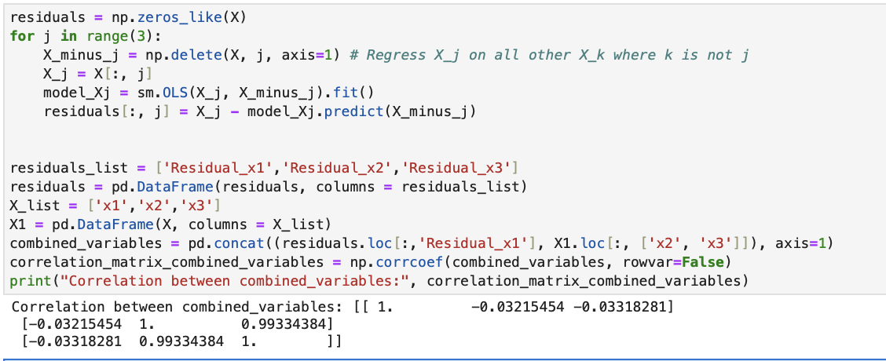
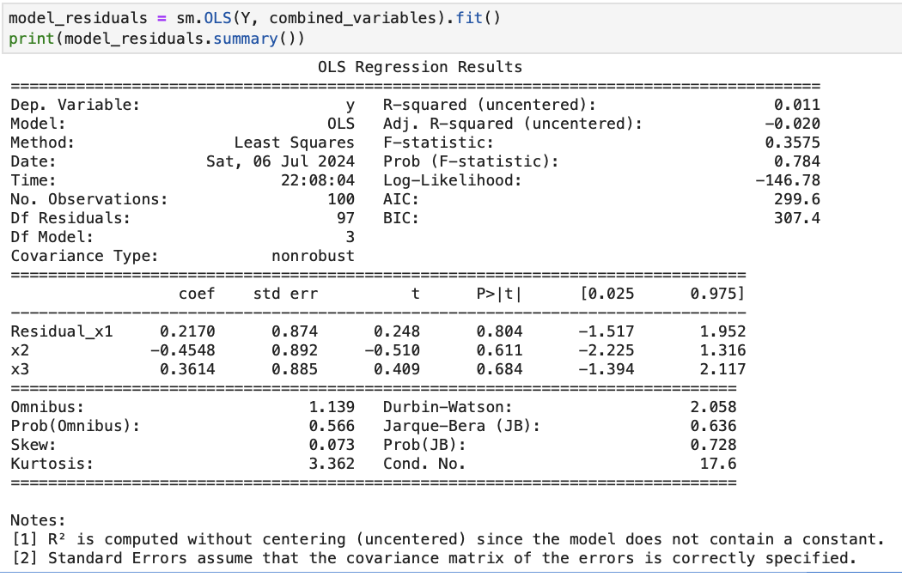

Hello, so I have been studying Linear models (including Ordinary Least Squares (OLS)) in the past few weeks. 
And I came across Frisch–Waugh–Lovell (FWL) Theorem. It basically states that multivariate regression can be deposed into (several) univariate regressions via holding one of the variable constant.

For example, you have a regression, 
$$y=\beta_{0}+\beta_{1}X_{1}+\beta_{2}X_{2}$$ 
So the steps for FWL theorem is
1. Regress $X_{1}$ on $X_{2}$ and take the residuals
2. Regress $y$ on $X_{2}$ and take the residuals
3. Regress the residuals from step 1 against the residuals from step 2 ($X_{1}-\hat{X}_{1}$ against $y-\hat{y}$)
	- you will get back the same coefficient ($\beta_{1}$) for $X_{1}$ as when regress $y$ on $X_{1}$ and $X_{2}$.

## Setting up the experiment
Mostly people have actually presented it in non-correlated/independent variables form. It works with correlated variables as well.

So first, lets generate some random variables of $Y$, which is our target, and 3 inputs of $X_{1}$, $X_{2}$ and $X_{3}$ variable that are highly correlated between each other. 

Now that we have our variables, we fit them onto OLS, regress $Y$ on the $X$.
$$Y=\beta_{1}X_{1}+\beta_{2}X_{2}+\beta_{3}X_{3}$$

Next, we shall regress each $X_{i}$ on the other two $X_{n\neq i}$ and get the residual. Then, check their correlation between residual of x1, which we will indicate as $r_{X_{1}|X_{2},X_{3}}$ as we trying to find the effect of $X_{1}$, and the other two variables, $X_{2}$ and $X_{3}$  
$$X_{1}=\alpha_{2}X_{2}+\alpha_{3}X_{3}$$
For the residual, we have
$$r_{X_{1}|X_{2},X_{3}}=X_{1}-\alpha_{2}X_{2}-\alpha_{3}X_{3}$$

We can see that the correlation between $r_{X_{1}|X_{2},X_{3}}$, $X_{2}$ and $X_{3}$ changes, it become uncorrelated from highly correlated between $X_{1}$, $X_{2}$ and $X_{3}$.

We regress $Y$ on $r_{X_{1}|X_{2},X_{3}}$, $X_{2}$, $X_{3}$.
$$Y=\beta_{1}r_{X_{1}|X_{2},X_{3}}+\gamma_{2}X_{2}+\gamma_{3}X_{3}$$

you will see that the coefficient of $r_{X_{1}|X_{2},X_{3}}$ is the same as the coefficient of $X_{1}$ as before. This is the beauty of FWL theorem. 

## How does FWL theorem work?
FWL theorem works cause of residuals, which are leftover effects after accounting for all the inputs $\mathbf{X}$ in the given OLS, are orthogonal to the residual $\hat{\epsilon}$. $$\mathbf{X}^{T}\hat{\epsilon}=0$$ Which is why the correlation/coefficient changes between $r_{X_{1}|X_{2},X_{3}}$ and $X_{2}$ and $X_{3}$, as they held both $X_{1}$ and $r_{X_{1}|X_{2},X_{3}}$ equally, thus, the coefficient of $r_{X_{1}|X_{2},X_{3}}$ and $X_{1}$ did not change.

We also can find out that $\beta_{1}=\dfrac{\sum_{i=1}^{n}(r_{i,X_{1}|X_{2},X_{3}} Y)}{\sum_{i=1}^{n}r_{i,X_{1}|X_{2},X_{3}}^{2}}$ (not proving it here)

However, this theorem doesn't hold if input $\mathbf{X}$ are perfectly correlated between each other, the regression will not be able to identify the individual changes in each input in $\mathbf{X}$, as the variables will move together. In another word, perfect multicollinearity will break this theorem.

## Conclusion
We can use this theorem to study the each input on how they affect other inputs when we fixed one input in the form of residual.
 
This theorem has been applied in machine learning which is known as "Double Machine Learning"

## References
The Frisch-Waugh-Lovell Theorem (FWL Theorem) from https://www.hbs.edu/research-computing-services/Shared%20Documents/Training/fwltheorem.pdf

